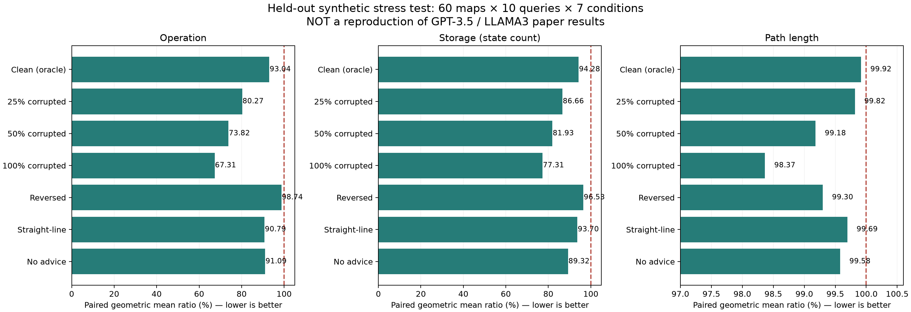

# Adaptive λ LLM-A* 구현 및 실험 보고서

> 이 문서는 기존 합성 안내 실험의 보고서입니다. 후속 실제 모델 결과는 [무료 로컬 LLM 보고서](local_llm_research.md)에 별도로 정리했습니다.

작성일: 2026-10-01 (Asia/Seoul) · 브랜치: research/adaptive-lambda

## 확인한 결과와 범위

람다 방식의 구현과 검증을 완료했다. 원본 저장소의 지도에 합성 waypoint를 넣은 **평가용 60개 지도·600개 문제·7개 안내 조건(4,200개 경로)**에서 원본 코드 대비 세 지표의 기하평균이 모두 낮았다. 일곱 조건을 동일 비중으로 합치면 Operation 15.68%, Storage 11.71%, 경로 길이 0.594% 감소했다.

**논문의 GPT-3.5/LLAMA3 출력으로 재현한 결과는 아니다.** 정확한 합성 안내는 Dijkstra 최적 경로에서 추출했으므로 일반 LLM보다 유리한 조건이다. 오류 안내 실험도 실제 LLM 오류의 분포를 대표하지 않는다. 논문 Table 1의 수치를 이 수치와 직접 비교해 “논문 성능을 넘었다”고 주장할 수 없다. 공개 GitHub 저장소와 프로젝트가 연결한 Hugging Face PPFT에서 논문 실험의 모델 출력 캐시를 찾지 못했다.

원문 참고: [LLM-A* 논문](https://arxiv.org/pdf/2407.02511), [원본 코드](https://github.com/SilinMeng0510/llm-astar), [공개 PPFT](https://huggingface.co/datasets/SilinMeng0510/PPFT).

## 구현

`llmastar/adaptive.py`의 `AdaptiveLLMAStar`는 다음 점수를 사용한다.

$$f(n)=g(n)+h_{goal}(n)+\lambda_t h_{waypoint}(n).$$

- detour ratio에 따라 초기 λ를 `initial_weight * exp(-alpha * max(D-1, 0))`로 조절한다. 직선거리 우회 비율은 장애물에 필요한 우회도 벌점 처리할 수 있는 약한 신호다.
- K번 확장마다 현재 확장 노드와 waypoint 사이의 거리 변화를 검사한다. 선택한 설정에서는 양의 진척을 유지하고, 정체·후퇴 시 λ를 0.5배로 줄인다. 확장 순서는 실제 이동 궤적이 아니므로 신호에 잡음이 있을 수 있다.
- waypoint 탐색량이 거리 기반 budget을 넘으면 추가로 λ를 0.5배로 줄인다.
- λ가 0.1보다 작으면 0으로 만든다. λ 변경과 waypoint 전환 시 모든 활성 OPEN 점수를 재계산하고 heapify한다.
- 오래된 큐 항목은 확장하지 않는다. 더 짧은 경로를 발견하면 CLOSED 노드를 재개방한다. 입력 지도를 수정하지 않고, 실패를 정상 결과로 반환한다.
- waypoint는 경로의 필수 경유점이 아니다. 원 논문의 이웃 발견 방식으로 전환하되, 실제 통과 가능한 간선인지 확인한 뒤 전환한다.
- waypoint skip은 구현했지만 기본값 False이며 주요 결과에서 사용하지 않았다.
- 표준 라이브러리만으로 planner가 실행된다. 지도 대신 다른 그래프도 사용할 수 있다. 상태는 heap 동률 처리가 가능한 tuple이어야 한다. 일반 A* 주장을 위해서는 해당 그래프 비용에 대한 허용적 heuristic을 제공해야 한다.

**λ=0은 그 순간의 우선순위를 A* 방식으로 바꾼다는 의미다. 과거 탐색을 없애거나 첫 해의 최적성을 보장하지 않는다.** 노드 재개방만으로 λ>0 구간의 최적성 문제가 사라지는 것도 아니다.

원본은 target이 goal일 때도 `h_goal + h_target`을 유지한다. 선택 설정도 `final_goal_weight=1`로 이 관례를 유지한다. 따라서 마지막 단계와 안내가 없는 경우는 `g+2h_goal` 순서이며 일반 A*가 아니다. 마지막 단계에서 `g+h_goal`을 원하면 `final_goal_weight=0`을 명시한다. 이 옵션을 바꾸면 아래 성능 결과는 적용되지 않는다.

선택한 설정:

```json
{
  "initial_weight": 2,
  "interval": 32,
  "good_progress": 0,
  "slow_decay": 0.8,
  "stalled_decay": 0.5,
  "min_weight": 0.1,
  "use_progress": true,
  "use_budget": true,
  "budget_factor": 8,
  "use_detour": true,
  "detour_alpha": 0.75,
  "final_goal_weight": 1,
  "reopen": true,
  "skip": false
}
```

## 실험 설계

- 데이터: 원본 `dataset/environment_50_30.json`, 100개 지도 × 10개 시작/목표 = 1,000개 문제. 실제 좌표 범위는 `[0,51]`, `[0,31]`이고 외곽은 0 및 size-1이다.
- 지도 단위 분할: train 20 / validation 20 / test 60. seed=20261001. 같은 지도의 시작/목표가 다른 split으로 섞이지 않는다.
- 36개 train 설정을 탐색하고 `b_i2.0_k32_d0.75`를 선택했다. test를 열기 전에 설정을 고정했다. validation/test에서는 튜닝하지 않았다. split과 선택 사유는 `benchmarks/selection.json` 및 각 metadata에 기록했다.
- 정확한 안내: Dijkstra 경로의 약 20/40/60/80% 위치를 추출한 4개 합성 waypoint. 길이가 짧으면 중복이 생길 수 있으며, 모든 방식에 동일한 원본 필터를 적용했다.
- 오류 안내: 4개 중 1/2/4개를 무작위 free cell로 교체했다. 원본 필터가 일부를 제거하므로 25/50/100%는 **필터 전** 교체 비율이며 최종 개수는 달라질 수 있다.
- 나머지 조건: 순서 반전, 직선 보간, 안내 없음. 같은 문제·조건·waypoint로 모든 방식을 실행했다.
- Dijkstra로 독립적인 최적 비용을 구했고, 모든 반환 경로의 간선·장애물 회피·끝점을 검사했다. A* 결과가 Dijkstra와 일치하는지도 검사했다.
- 원본 replay는 원본 LLMAStar 클래스 AST를 그대로 사용한다. 모델 호출을 저장된 waypoint로 바꾸고 그림 출력만 끈다. 원본 geometry와 같은 선분 충돌 판정을 사용하며 Shapely와 별도로 대조했다.

## 최종 test 결과

아래는 동일 입력의 **원본 코드 replay 대비** 비율의 기하평균이다. 원본 중복 확장 제거와 지표 정의 정리 효과도 포함된다.

| 안내 조건 | Operation 감소 | Storage 감소 | 경로 길이 감소 | 유효 경로 |
|---|---:|---:|---:|---:|
| 정확한 합성 안내 | 6.96% | 5.72% | 0.084% | 600/600 |
| 25% 오류 | 19.73% | 13.34% | 0.182% | 600/600 |
| 50% 오류 | 26.18% | 18.07% | 0.819% | 600/600 |
| 100% 오류 | 32.69% | 22.69% | 1.635% | 600/600 |
| 순서 반전 | 1.26% | 3.47% | 0.702% | 600/600 |
| 직선 보간 안내 | 9.21% | 6.30% | 0.306% | 600/600 |
| 안내 없음 | 8.91% | 10.68% | 0.423% | 600/600 |



세 지표가 각각 엄격하게 좋아진 개별 문제는 479/4200개다. 세 지표 모두 나빠지지 않고 하나 이상 좋아진 문제는 2700/4200개다. **모든 문제에서 셋 다 좋아진 결과가 아니다.** 경로 개선 폭은 정확한 안내에서 매우 작다.

Operation의 95번째 백분위 비율은 clean 1.307배, corrupt100 2.418배다. 평균 개선과 별개로 일부 문제에서는 상당한 성능 악화가 있다. 최악 성능 제한은 보장하지 않는다.

## 공통 구현에서의 비교와 효과 분리

`fixed_1_controlled`는 동일한 새 탐색기·재개방·합법적인 waypoint 전환·최종 goal 가중치 1을 사용하고, λ를 1로 고정한다. `fixed_2_controlled`는 λ를 2로 고정한다. 두 방식 모두 progress/budget/detour를 끈다. 큐 수정만으로 얻는 이득을 제안 방식의 이득으로 과장하지 않기 위한 비교다.

| 비교 기준 | Operation 비율 | Storage 비율 | 경로 길이 비율 |
|---|---:|---:|---:|
| legacy | 0.8432 | 0.8829 | 0.9941 |
| fixed_1_controlled | 0.9396 | 0.9702 | 0.9970 |
| fixed_2_controlled | 1.1210 | 1.0482 | 0.9837 |

공통 구현의 고정 λ=1 대비 Operation 6.04%, Storage 2.98%, 경로 길이 0.296% 감소했다. 단, clean 조건에서는 Storage가 약 2.88% 증가했다.

고정 λ=2는 전체 Operation/Storage가 adaptive보다 적다. adaptive는 경로 길이가 더 짧다. **adaptive가 모든 고정 가중치를 세 지표 모두에서 압도하지는 않는다.** initial λ=2의 효과와 confidence 신호의 효과를 함께 해석해야 한다.

제거 실험(모두 원본 replay 대비):

| 방식 | Operation 비율 | Storage 비율 | 경로 길이 비율 |
|---|---:|---:|---:|
| adaptive | 0.8432 | 0.8829 | 0.9941 |
| no_progress | 0.8447 | 0.8812 | 0.9962 |
| no_budget | 0.8408 | 0.8800 | 0.9942 |
| no_detour | 0.7577 | 0.8620 | 1.0027 |
| no_reopen | 0.7878 | 0.8818 | 0.9980 |

지도 단위 cluster bootstrap 2,000회, 비율의 95% 구간:

```json
{
  "legacy": {
    "operation": [
      0.8251598818515667,
      0.8620814688200984
    ],
    "storage": [
      0.8696464017885069,
      0.8968601410224537
    ],
    "length": [
      0.9928611778842019,
      0.9951953692396396
    ]
  },
  "fixed_1_controlled": {
    "operation": [
      0.9220733847804806,
      0.9568141258510088
    ],
    "storage": [
      0.954482633676553,
      0.9847225709268491
    ],
    "length": [
      0.9959754179398186,
      0.9979843369301377
    ]
  }
}
```

문제별 독립 bootstrap을 사용하지 않고 동일 지도 내 상관을 유지했다. 일곱 안내 조건을 동일 비중으로 섞은 구간이며 실제 LLM 사용 환경의 비중을 추정한 결과는 아니다.

## 환경 전이와 실제 메모리 점검

설정 변경 없이 validation 지도를 좌표 전치, 2배 확대, 가중 간선 환경으로 바꿨다. 각 환경 60개 시작/목표 × 3개 안내 조건 = 180개 경로를 평가했고 모두 유효했다. 비교 기준은 공통 구현 fixed-λ=1이다.

| 환경 | Operation 비율 | Storage 비율 | 경로 비용 비율 |
|---|---:|---:|---:|
| transpose | 0.9166 | 0.9394 | 0.9992 |
| scale2 | 0.7947 | 0.9466 | 0.9927 |
| weighted | 0.9383 | 0.9624 | 1.0000 |

weighted의 비용은 이동 길이에 목적지 지역 배수를 곱한 값이다. 표의 마지막 열은 기하학적 경로 길이가 아니라 **누적 이동 비용**이다. 이 실험은 소규모 합성 전이 검사이며 Moving AI 지도, 다른 모델, 3D 또는 동적 환경에 대한 일반화를 입증하지 않는다.

Storage는 실제 bytes가 아니다. 보충 검사에서는 따로 tracemalloc으로 planner의 Python 할당 최대값을 측정했다(20개 validation 시작/목표 × clean/corrupt100 = 방법당 40회). 공유 지도 캐시·LLM 메모리·native 메모리는 제외된다.

- clean: adaptive 41,474 bytes / fixed-λ=1 40,530 bytes (1.023배).
- corrupt100: adaptive 74,784 bytes / fixed-λ=1 75,632 bytes (0.989배).

상태 수가 줄어도 λ 기록과 큐 재계산 때문에 실제 메모리 감소가 반드시 따라오지는 않았다. 실행 시간은 지도 캐시 준비, Dijkstra, LLM 생성, 그림 저장을 제외한 planner 시간이다. 원본은 충돌 검사 캐시를 쓰지 않으므로 원본 대비 시간 차이를 λ 효과로 해석해서는 안 된다. 반복 측정한 엄밀한 시간 벤치마크는 아직 하지 않았다.

## 현재 assistant가 만든 안내: 12개 문제 pilot

원본 지도 설명만 보고 현재 대화 assistant가 작성한 waypoint를 별도로 저장했다. 이 파일은 `benchmarks/assistant_waypoints_pilot.json`이며 원본 논문의 모델 출력은 아니다. 사례별 Dijkstra 경로를 보기 전에 작성했고 후속 수정은 하지 않았다. exact model/version과 sampling 설정을 기록하지 못해 재현 가능한 모델 벤치마크로 사용하지 않는다.

12/12개가 유효했고 원본 replay 대비 Operation 0.93%, Storage 2.67% 감소, 경로 길이 비율 1.0000였다. 작은 pilot에서는 경로 길이 개선이 관찰되지 않았다.

## 실행과 다음 검증

```bash
python3 -m venv .venv
.venv/bin/python -m pip install -r requirements-research.txt
.venv/bin/python -m unittest discover -s tests -v
.venv/bin/python -m benchmarks.run --split test --config benchmarks/selected_config.json --methods astar fixed_1 fixed_025 fixed_05 fixed_2 adaptive no_progress no_budget no_detour no_reopen fixed_2_controlled fixed_1_controlled --output results/test --save-paths
.venv/bin/python -m benchmarks.transfer
.venv/bin/python -m benchmarks.run --split test --waypoints benchmarks/assistant_waypoints_pilot.json --config benchmarks/selected_config.json --methods astar fixed_1_controlled adaptive --output results/assistant_pilot --save-paths
.venv/bin/python -m benchmarks.report
```

실제 모델에서 얻은 waypoint JSON도 `--waypoints FILE`로 평가할 수 있다. 형식은 pilot 파일과 동일한 `map_id`, `sample_id`, `waypoints` 배열이며 provenance에 모델·prompt·생성 옵션을 기록해야 한다. 실행기는 API 호출을 하지 않는다. 실제 LLM의 전체 held-out 출력을 확보한 뒤 동일한 설정으로 평가해야 논문 대비 개선 주장을 검토할 수 있다.

코드 검증: unittest 15개 통과. 시작=목표, 도달 불가, 잘못된 입력/waypoint, queue 갱신, CLOSED 재개방, 장애물 끝점, λ=0과 Dijkstra 일치, 비격자 가중 그래프, 지도 분할을 검사했다. Python 3.14.6.

데이터 SHA256: `856705d9c27eef8d457c5d79ba33ecd0eb2230835d36a20836376c6f64c6efdc`. 원시 결과·waypoint·경로·λ 이력·설정·소스 SHA256은 `results/test/`에 있다. upstream source는 수정하지 않았다.
