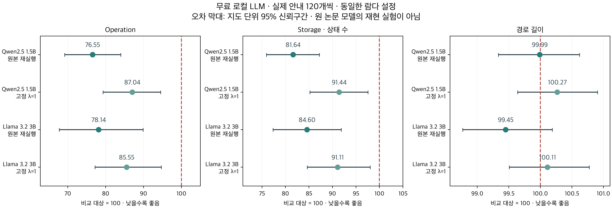

# 무료 로컬 LLM 실험 보고서

작성일: 2026-10-01 (Asia/Seoul) · 프로토콜: local-free-v2

## 핵심 결과

- Qwen2.5 1.5B: 같은 엔진의 고정 λ=1 대비 Operation 12.963% 감소, Storage 8.557% 감소, 경로 길이 0.268% 증가.
- Llama 3.2 3B: 같은 엔진의 고정 λ=1 대비 Operation 14.451% 감소, Storage 8.886% 감소, 경로 길이 0.114% 증가.

세 지표가 동시에 개선됐는지는 각 모델의 방향과 아래 신뢰구간을 함께 확인해야 한다. 원본 재실행 대비 감소만으로 적응형 람다의 효과를 판단하지 않는다.

## 실행 범위

**유료 API 없이 이 Mac에서 실제 모델 출력을 생성해 비교했다. API 사용료는 0달러다.** Apple M3·메모리 8GB 환경에서 Ollama로 Qwen2.5 1.5B와 Llama 3.2 3B를 순차 실행했다. 모델 가중치는 로컬에 저장했으며 GitHub에는 올리지 않는다. 로컬 실행에도 전력·시간·저장 공간은 사용된다.

최종 프로토콜의 실제 응답은 320개다. 모델당 검증 20개, 평가 120개, 좌표 전치 10개, 2배 확대 10개를 생성했다. 평가용 지도 60개 모두에서 미리 정한 문제 ID 0·5를 선택했다. 전체 600문제 중 120문제를 사용한 부분 평가다. 두 모델의 평가·전이 비교는 총 6,200회 경로 탐색이다. 최종 생성 기록의 소요 시간 합계는 627.8초이며 모델 로딩을 포함한다.

**원 논문의 GPT-3.5·Llama 3 8B 모델을 재현한 실험은 아니다.** 다른 크기의 양자화 모델, Ollama 템플릿, 추가 출력 지시를 사용했다. 따라서 논문 수치보다 우수하다고 주장할 수 없다.

모델 식별 정보:

- `qwen2.5:1.5b`: `65ec06548149b04c096a120e4a6da9d4017ea809c91734ea5631e89f96ddc57b` · Q4_K_M
- `llama3.2:3b`: `a80c4f17acd55265feec403c7aef86be0c25983ab279d83f3bcd3abbcb5b8b72` · Q4_K_M

## 동일 안내에서의 비교

각 문제에서 LLM 출력을 한 번 생성하고 원본 재실행·A*·고정 λ=1·고정 λ=2·적응형 람다에 같은 좌표를 제공했다. 람다는 합성 학습 실험에서 선택한 설정을 그대로 사용했으며 실제 LLM 결과로 재조정하지 않았다. 아래는 **변형하지 않은 실제 모델 안내**의 지표 비율 기하평균이다. 1보다 작으면 적응형 방식이 비교 대상보다 낮은 값을 보인다.

| 모델 | 비교 대상 | Operation 비율 | Storage 비율 | 경로 길이 비율 |
|---|---|---:|---:|---:|
| Qwen2.5 1.5B | 원본 재실행 | 0.7655 | 0.8164 | 0.9999 |
| Qwen2.5 1.5B | 같은 엔진의 고정 λ=1 | 0.8704 | 0.9144 | 1.0027 |
| Qwen2.5 1.5B | 같은 엔진의 고정 λ=2 | 1.0745 | 1.0128 | 0.9853 |
| Llama 3.2 3B | 원본 재실행 | 0.7814 | 0.8460 | 0.9945 |
| Llama 3.2 3B | 같은 엔진의 고정 λ=1 | 0.8555 | 0.9111 | 1.0011 |
| Llama 3.2 3B | 같은 엔진의 고정 λ=2 | 1.0896 | 0.9817 | 0.9754 |



원본과의 비교에는 큐 처리·노드 재개방·목표 전환 등의 공통 구현 변경도 포함된다. **람다 적응 효과는 같은 엔진의 고정 가중치 비교군으로 판단해야 한다.** 모델의 성능 차이와 탐색기의 성능 차이를 구분한다.

- Qwen2.5 1.5B: 적응형 경로 620/620개 유효. 실제 안내에서 고정 λ=1 대비 세 지표가 모두 엄격하게 개선된 문제는 1/120개, 약한 Pareto 개선은 36/120개.
- Llama 3.2 3B: 적응형 경로 620/620개 유효. 실제 안내에서 고정 λ=1 대비 세 지표가 모두 엄격하게 개선된 문제는 6/120개, 약한 Pareto 개선은 51/120개.

모든 문제에서 세 지표가 동시에 개선되는지는 위 개별 문제 수로 확인해야 한다. 생성 실패를 제외한 성공 사례만 골라내지 않았으며, 안내가 없는 상태에서도 탐색을 진행했다. 경로 탐색 성공률과 LLM의 안내 생성 성공률은 다른 지표다.

## 신뢰구간

평가 지도 60개를 묶음 단위로 2,000회 재표집했다. 같은 지도에 속한 두 문제의 상관을 유지한 비율의 95% 구간이다. 구간이 1을 포함하면 해당 지표의 개선을 확정적으로 주장하지 않는다. 모델을 여러 생성 시드로 반복한 구간은 아니다.

| 모델 | 비교 대상 | Operation 95% 구간 | Storage 95% 구간 | 경로 길이 95% 구간 |
|---|---|---:|---:|---:|
| Qwen2.5 1.5B | 원본 재실행 | [0.6914, 0.8398] | [0.7595, 0.8720] | [0.9933, 1.0062] |
| Qwen2.5 1.5B | 같은 엔진의 고정 λ=1 | [0.7930, 0.9447] | [0.8521, 0.9756] | [0.9964, 1.0090] |
| Llama 3.2 3B | 원본 재실행 | [0.6773, 0.8984] | [0.7734, 0.9188] | [0.9877, 1.0019] |
| Llama 3.2 3B | 같은 엔진의 고정 λ=1 | [0.7717, 0.9470] | [0.8465, 0.9804] | [0.9951, 1.0078] |

## 강건성 검사

실제 출력에 순서 반전·절반 누락·절반 무작위 교체를 적용하거나 안내를 모두 제거했다. 추가 모델 호출 없이 동일 출력의 변형을 비교한다. 이 변형은 실제 LLM 오류 분포를 대표하는 데이터가 아니라 통제된 스트레스 조건이다. 아래 비교 기준은 **같은 엔진의 고정 λ=1**이다. P95는 문제별 Operation 비율의 95번째 백분위수로, 평균과 별도로 일부 문제의 악화를 보여준다.

| 모델 | 안내 조건 | Operation 비율 | Storage 비율 | 경로 길이 비율 | Operation P95 비율 |
|---|---|---:|---:|---:|---:|
| Qwen2.5 1.5B | 실제 모델 안내 | 0.8704 | 0.9144 | 1.0027 | 1.643 |
| Qwen2.5 1.5B | 순서 반전 | 0.8955 | 0.9278 | 0.9980 | 1.842 |
| Qwen2.5 1.5B | 절반 누락 | 0.9467 | 0.9647 | 0.9991 | 1.165 |
| Qwen2.5 1.5B | 절반 무작위 교체 | 0.9203 | 0.9213 | 0.9938 | 3.148 |
| Qwen2.5 1.5B | 안내 없음 | 1.0000 | 1.0000 | 1.0000 | 1.000 |
| Llama 3.2 3B | 실제 모델 안내 | 0.8555 | 0.9111 | 1.0011 | 2.243 |
| Llama 3.2 3B | 순서 반전 | 0.8010 | 0.8435 | 0.9941 | 2.170 |
| Llama 3.2 3B | 절반 누락 | 0.9015 | 0.9445 | 0.9965 | 2.613 |
| Llama 3.2 3B | 절반 무작위 교체 | 0.8290 | 0.8721 | 0.9932 | 2.453 |
| Llama 3.2 3B | 안내 없음 | 1.0000 | 1.0000 | 1.0000 | 1.000 |

평균 개선은 최악의 경우의 확장 횟수 제한이나 모든 문제의 우위를 보장하지 않는다. 기본 마지막 단계는 원본 관례인 `g + 2*h_goal`이며, 안내 실패 시에도 일반 A*의 최적성 보장은 없다. A* 비교군은 별도로 `g + h_goal` 순서를 사용한다.

## 일반성 검사

동일한 람다 설정을 두 모델에 적용했다. 평가용 지도 중 처음 10개의 문제 ID 0을 좌표 전치·2배 확대하고, 변형한 입력마다 **새로운 LLM 안내**를 생성했다. 아래 비교 기준도 고정 λ=1이다.

| 모델 | 환경 | 문제 수 | Operation 비율 | Storage 비율 | 경로 길이 비율 |
|---|---|---:|---:|---:|---:|
| Qwen2.5 1.5B | 좌표 전치 | 10 | 0.8328 | 0.8814 | 0.9971 |
| Qwen2.5 1.5B | 2배 확대 | 10 | 0.5183 | 0.6647 | 0.9989 |
| Llama 3.2 3B | 좌표 전치 | 10 | 0.6292 | 0.8050 | 0.9779 |
| Llama 3.2 3B | 2배 확대 | 10 | 0.8429 | 0.9922 | 1.0021 |

두 모델과 작은 전이 검사에서의 결과다. 전이 입력은 기존 지도의 변형이므로 완전히 새로운 지도 분포에 대한 검증은 아니다. 대형 모델·외부 지도·3차원·동적 환경으로 일반화됐다고 판단할 수 없다.

## 안내 자체의 오류와 메모리

아래는 원본 좌표 환경의 120개 모델 응답이다. 좌표가 정수 목록으로 읽혔다고 해서 올바른 경유점이라는 뜻은 아니다. 시작·목표 불일치에는 파싱 실패도 포함되므로 열을 합산하지 않는다.

| 모델 | 파싱 실패 | 출력 한도 도달 | 시작·목표 좌표 불일치 | 사용 가능한 중간 안내 없음 |
|---|---:|---:|---:|---:|
| Qwen2.5 1.5B | 1/120 | 0/120 | 30/120 | 21/120 |
| Llama 3.2 3B | 14/120 | 14/120 | 98/120 | 17/120 |

파싱 실패는 빈 안내로 변환했다. 정상적으로 읽은 좌표에는 원본의 장애물·범위 필터를 동일하게 적용했다. 모델 답변을 최적 경로로 보정하거나 성공한 응답만 재선택하지 않았다. 실제 목표 좌표는 입력에서 유지하며, LLM 경유점은 강제 제약이 아니다. Dijkstra는 모델 응답을 생성한 **뒤** 평가 정답과 반환 경로의 검증에만 사용했다.

Storage는 실제 바이트가 아니라 상태 수다. 별도의 Python 할당 추적 결과는 다음과 같다.

| 모델 | 적응형 최대 할당 평균 | 고정 λ=1 최대 할당 평균 | 비율 |
|---|---:|---:|---:|
| Qwen2.5 1.5B | 44,371 bytes | 48,362 bytes | 0.9175 |
| Llama 3.2 3B | 56,579 bytes | 63,002 bytes | 0.8981 |

공유 그래프 캐시·LLM·네이티브 메모리는 위 측정에 포함되지 않는다. 상태 수 감소를 전체 시스템 메모리 감소로 해석하지 않는다. 경로 탐색 시간에도 LLM 생성과 그래프 준비 시간은 포함되지 않는다.

## 프롬프트 선택과 실패 기록 보존

초기 v1은 원본 `standard_gpt` 프롬프트에 격자 범위만 추가해 사용했다. 검증 20문제에서 Qwen은 파싱 실패 4개, Llama는 경로 대신 코드를 생성해 20개 모두 출력 한도에 도달하고 파싱에 실패했다. v1의 응답은 삭제하지 않았다. 자동으로 시작됐던 Llama v1 평가 생성은 첫 4개 응답 후 중단했으며, 이 불완전 기록도 보존했다. v1 Qwen 평가도 최종 비교 표에는 합치지 않는다.

검증 결과를 바탕으로 두 모델에 동일하게 “정수 좌표 최대 8개, 시작·목표 포함, 코드·설명 없이 좌표만 반환”이라는 시스템 지시를 추가했다. v2 검증에서는 Qwen 20개 중 20개, Llama 20개 중 19개가 파싱됐다. 이 지시와 평가 규칙을 고정한 커밋 `3fae8ca` 이후 최종 v2 평가를 실행했다. 각 생성 단계는 첫 응답 전에 `plan.json`을 기록한다.

최종 실험에서는 형식 오류·출력 잘림을 이유로 재시도하지 않았다. 원문 응답, 입력, 프롬프트, 시스템 지시, 모델 해시, 템플릿 해시, 생성 설정, 토큰 수, 소요 시간을 저장했다. 온도 0·고정 시드도 서로 다른 환경에서 완전히 같은 출력을 보장하지 않으므로 저장된 캐시를 이용한 재실행이 기준이다.

## 재현 방법

Ollama와 모델을 설치한 뒤 저장소 최상위 폴더에서 실행한다. 아래 모델은 Ollama 로컬 라이브러리의 [Qwen2.5 1.5B](https://ollama.com/library/qwen2.5:1.5b)와 [Llama 3.2 3B](https://ollama.com/library/llama3.2)다. 생성기는 로컬 주소만 사용하고 클라우드 모델·리디렉션을 거부한다.

```bash
ollama pull qwen2.5:1.5b
ollama pull llama3.2:3b
.venv/bin/python -m benchmarks.local_llm --model qwen2.5:1.5b --split test --output results/local_llm/qwen_test_v2
.venv/bin/python -m benchmarks.local_llm --model llama3.2:3b --split test --output results/local_llm/llama_test_v2
.venv/bin/python -m benchmarks.local_evaluate --inputs results/local_llm/qwen_test_v2/waypoints.json results/local_llm/qwen_transpose_v2/waypoints.json results/local_llm/qwen_scale2_v2/waypoints.json --output results/local_llm/qwen_evaluation_v2
.venv/bin/python -m benchmarks.local_evaluate --inputs results/local_llm/llama_test_v2/waypoints.json results/local_llm/llama_transpose_v2/waypoints.json results/local_llm/llama_scale2_v2/waypoints.json --output results/local_llm/llama_evaluation_v2
.venv/bin/python -m benchmarks.local_report
```

위 생성 명령은 평가용 원본 좌표 환경을 재생성한다. 좌표 전치 생성에는 `--domain transpose --max-maps 10 --sample-ids 0`, 2배 확대 생성에는 `--domain scale2 --max-maps 10 --sample-ids 0`을 추가하고 출력 폴더도 각 환경에 맞게 지정한다. 검증에는 `--split validation --max-maps 2 --sample-ids 0 1 2 3 4 5 6 7 8 9`를 사용한다. 저장한 계획과 현재 모델·소스 해시가 다르면 새 폴더를 지정해야 한다. 다운로드·로컬 생성 없이 저장된 JSON만으로 비교 평가를 다시 실행할 수도 있다.

원시 데이터는 `results/local_llm/`, 고정 프로토콜은 `benchmarks/local_protocol.json`에 있다. 이전 합성 실험과 수치는 [기존 연구 보고서](adaptive_lambda_research.md)에 별도로 유지한다.
